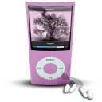
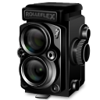
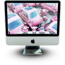

iPage – Paging your list
=====
iPage sound like “iPad”  , but it’s pretty too.
If you want a plugin jquery to implement paging you list as “ul” or “ol” or “div” with child, you can use this plugin. It’s very easy and smart to use with many options to help you customize,
+ Options with default value
- pagenumber : 1 // This value is page will display when in initialize
- children : ‘li’ // Children of root element you want paging
- numPerPage: 5 // Number of item display a page
- numButton : 9 // Number button of navigation to change page display


+ How to use 
First insert javascript and stylesheet(css) in your page
* Note stylesheet file have a important class you must include, you can customize style navigation in here
* 
```html
<script type="text/javascript" src="js/jquery.ipage.min.js"></script> 
<link rel="stylesheet" type="text/css" href="css/ipage.css" />  
```

HTLM formart

```html

<ul class="gifts">
    <li class="gift">     
        
        <span>Gift Number 1</span>
    </li>
    <li class="gift">
        
        <span>Gift Number 2</span>
    </li>
    <li class="gift">
        
        <span>Gift Number 3</span>
    </li>
    <li class="gift">
        
        <span>Gift Number 4</span>
    </li>
    <li class="gift">
        
        <span>Gift Number 5</span>
    </li>
    <li class="gift">
        
        <span>Gift Number 6</span>
    </li>
    <li class="gift">
        
        <span>Gift Number 7</span>
    </li>
    <li class="gift">
        
        <span>Gift Number 8</span>
    </li>
    <li class="gift">
        
        <span>Gift Number 9</span>
    </li>
    <li class="gift">
        
        <span>Gift Number 10</span>
    </li>
    <li class="gift">
        
        <span>Gift Number 11</span>
    </li>
    <li class="gift">
        
        <span>Gift Number 12</span>
    </li>
    <li class="gift">
        
        <span>Gift Number 13</span>
    </li>
    <li class="gift">
        
        <span>Gift Number 14</span>
    </li>
    <li class="gift">
        
        <span>Gift Number 15</span>
    </li> 
    <li class="gift">
        
        <span>Gift Number 16</span>
    </li> 
    <li class="gift">
        
        <span>Gift Number 17</span>
    </li> 
    <li class="gift">
        
        <span>Gift Number 18</span>
    </li>     
    <li class="gift">
        
        <span>Gift Number 19</span>
    </li>     
    <li class="gift">
        
        <span>Gift Number 20</span>
    </li>     
    <li class="gift">
        
        <span>Gift Number 21</span>
    </li>     
    <li class="gift">
        
        <span>Gift Number 22</span>
    </li>     
    <li class="gift">
        
        <span>Gift Number 23</span>
    </li>     
</ul> 
```

And start action now 

```html
  $(document).ready(function(){ 
    $("ul.gifts").ipage({
        pagenumber: 1,
        buttonClickCallback: PageGiftClick,
        root : 'ul.gifts',
        numPerPage : 5 ,
        children: 'li.gift',
        numButton: 5,
    }); 
});
```
